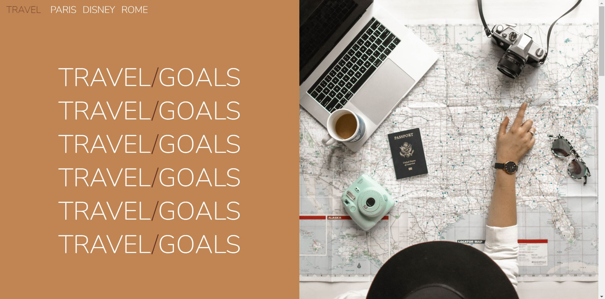

# Travel Goals based on Museum of Candy of Web Developer Bootcamp 2022 from Colt Steele

This is a Project proposed by Colt Steele in his course Web Developer Bootcamp. In the course, Steele made a page about candies and to make this project more personal, I decided to make about some places around the wolrd I'd like to visit. 

## Table of contents

- [Overview](#overview)
  - [Screenshot](#screenshot)
  - [Links](#links)
- [My process](#my-process)
  - [Built with](#built-with)
  - [What I learned](#what-i-learned)
  - [Useful resources](#useful-resources)
- [Author](#author)

## Overview

### Screenshot

### Links

- Live Site URL: [Travel Goals](https://thamyrix-travel-goals.netlify.app/)

## My process

### Built with

- HTML5

- CSS

- Flexbox

- Bootstrap and Grid

- Javascript 

  

### What I learned

I learned how to use grid, bootstrap, svg icons and a little taste of javascript, that I used for the navbar.

### Useful resources

- All the content and the Q&A from the course.

## Author

- Website - [Thamyris Szymanski](https://github.com/thamyrix)

  
